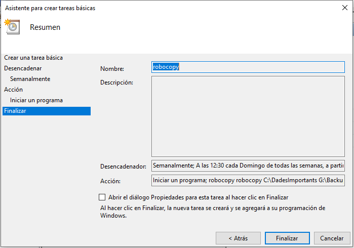

# Gestió d'usuaris i serveis


Per a la documentació completa visita [mkdocs.org](https://www.mkdocs.org).


---
## Introducció

Aquest projecte té com a objectiu implementar, configurar i documentar una instal·lació de Windows 10 dins d'una màquina virtual, centrant-se en la gestió del sistema operatiu des d'un punt de vista tècnic. Es treballarà sobre diferents àmbits com la gestió d'usuaris, processos, permisos, sistemes de fitxers, còpies de seguretat, entre d'altres, seguint criteris d'optimització i seguretat. La documentació s'ha redactat utilitzant MkDocs per facilitar-ne la consulta i organització.


---

## Gestió de processos

La gestió de processos és una part fonamental per garantir el bon funcionament i el rendiment del sistema. En aquest apartat s'analitzen els processos actius en el sistema, els serveis associats i les eines disponibles per controlar-los i optimitzar-ne l’execució.

### Tipus de processos
Els processos poden ser:

* Processos de sistema: essencials per al funcionament de Windows.

* Processos d'usuari: iniciats manualment per l'usuari o automàticament en iniciar la sessió.

* Processos en segon pla: habitualment serveis o aplicacions sense interfície visual.

### Eines de gestió de processos
* Administrador de tasques (Task Manager): eina gràfica per monitoritzar i gestionar processos, ús de recursos i aplicacions.

* tasklist / taskkill: comandes per consultar i tancar processos des de línia d’ordres.

* PowerShell (Get-Process): consulta avançada de processos amb filtratge.

#### ADMINISTRACIÓ DE TASQUES (TASK MANAGER)

1. Com podem observar amb aquesta eina gràfica que proporciona el propi sistema operatiu Windows 10 podem observar tots el processos actius a temps real. Si obrim qualsevol programa com Google Chrome podrem veure que automaticament es genera un proces pare i si el despleguem, estaran tots els seus processos fills o subprocessos. També ens mostra informació valiosa com per exemple consum de la CPU, Memoria, Disc i Xarxa en format de percentatge.        


2. A més si anem a la següent pàgina podrem veure el rendiment del sistema segons diferents apartats com CPU, Memoria, Disc i Xarxa.        


3. Seguidament a la tercera pàgina veurem l'historial de les aplicacions aquest és important per veure quan de temps han estat utilitzant la CPU i altres recursos.     


4. En la quarta pàgina podrem observar el impacte que tenen les aplicacions del llistat en quan al inici i actualitzat en cada reinici del sistema en la CPU i el disc.      


5. A continuació podrem observar els usuaris que estan actualment actius consumint recursos. En aquesta cas podem observar que només és un, anomenat "alumne" i si els despleguem podrem observar tots el processos que ha generat.     


6. Després en la següent pàgina veurem els detalls dels processos, en aquest cas ens mostra el nom, el PID, si està en execució o suspès, el nom de l'usuari que la generat i altres paràmetres. Com podem observar hi ha 9 processos de Chrome, cadascun té un PID diferent i estan tots en execució, a més si ens fixem en l'usuari indica que és "alumne" qui els ha generat.        


7. Per acabar, podem veure que hi ha una última pàgina que indica els serveis actius, aquest són majoriatariament processos del sistema.        


8. Tot seguit, una vegada que ja hem explicat totes les funcions dels apartats de l'Administrador de tasques, eliminarem el procès de Chrome. Per fer-ho d'una forma molt sencilla haurem d'anar a la primera pàgina, fer clic dret en el procès pare de "Google Chrome" i clicar en "Finalitzar tasca", així ens assegurem que cap subprocès queda en execució.        


9. També podem finalitzar tasques a la pàgina de "Detalls", però en aquesta no sabem quin és el procés pare, per tant, no és tant practic. Encara que normalment sol ser el primer procés.      


#### Comandes útils en CMD

##### TASKLIST 

1. Podem utilitzar `tasklist` per llistar totes els processos en terminal, com podem observar si obrim Google Chrome ens sortiran els seus processos, per nom del procés, PID, nom de sessió i ús de memoria.       


2. En aquest cas si volem realment buscar el processos d'un programa concret com Chrome és inpractic anar buscant en un llistat tan llarg, per tant podrem filtrar a partir de nom de procés, en aquest cas "chrome.exe".       


##### TASKKILL

1. Per eliminar un procés haurem d'usar la comanda `taskkill`. Seguidament eliminarem el proces de Chrome a partir del PID. El primer que haurem de fer és localitzar el PID del primer procés del programa i executar la comanda, com podem veure si resulta correcte ens retoranarà un missatge de confirmació. Després comprovem que el procés està realment mort.       


2. Tot seguit, farem el mateix però matant el procés a partir del nom.      


#### Comandes útils en PowerShell

1. Per llistar el processos utilitzarem la comanda "Get-Process".       


2. Si volem llistar per nom del procés ho farem amb "Get-Process -Name chrome".     


3. També podem eliminar processos amb `Stop-Process`, per nom i per PID.        


---

## Gestió d'usuaris i grups

Una bona administració dels comptes d'usuari i grups és clau per garantir la seguretat i l'organització del sistema. A Windows 10, es poden crear, modificar i eliminar usuaris i grups tant des de la interfície gràfica com des de la línia d’ordres.


### Eines gràfiques

1. Per crear usuari i grups en GUI anirem a Administracio d'equips aquest és un programa que inclou el propi sistema operatiu. Si despleguem l'apartat "Usuaris i grups locals" veurem que hi han dos carpetes una d'usuaris i l'altra de grups. Vaig a començar amb le usuaris, si fem clic dret dins ens apareixerà l'opció de crear un nou usuari.       


2. Una vegada se'ns ha obert la finestra, omplirem les dades del usuari, en aquest cas estic creant el meu usuari. Com podem observar hi han 4 opcions sobre la contrasenya, en aquest cas jo he decidit que no vull que expire mai.        


3. Al tancar la finestra podrem veure que l'usuari ja està al llistat.      


4. Seguidament iniciarem sessió amb l'usuari Maria Gutierrez.       


5. A continuació realitzarem un procés similar per crear els grups, entrarem dins de la carpeta "Grups" i farem clic dret per afegiru un nou grup.      


6. Seguidament afegirem un nom al grup en aquest cas "INFORMATICA", una descripció i membres clicant en "Agregar". Se'ns apareixerà una finestra petita on afegirem el usuaris, en aquest cas he afegit a maria.        


7. Per últim podrem observar que ja tenim el grup "INFORMATICA" al llistat.     


### Comandes bàsiques

Una bona gestió d’usuaris i grups des de la línia d’ordres ens permet automatitzar tasques, aplicar permisos ràpidament i tenir més control del sistema.

1. Les primeres comandes més importants ha aprendre son les de visualització de llistat d'usuaris, grups i integrants de grups. Com podem observar a la captura son les següents:
```
net user
```
```
net localgroup
```
```
net localgroup INFORMATICA
```


2. Seguidament, creem un usuari local anomenat prova_usuari. Aquesta acció afegeix un nou compte d’usuari sense contrasenya inicial.
```
net user prova_usuari /add
```


3. A continuació, assignem una contrasenya segura al compte creat. Amb això, l’usuari ja pot iniciar sessió amb la seva contrasenya definida.
```
net user prova_usuari Hola1234
```


4. Seguidament, afegim l’usuari al grup d’Administradors per atorgar-li privilegis elevats dins del sistema. Aquesta acció permet comprovar si rep permisos heretats del grup.
```
net localgroup Administradors prova_usuari /add
```


5. Tot seguit, creem un grup local personalitzat anomenat Proves, útil per simular entorns de treball amb estructures pròpies.
```
net localgroup Proves /add
```


6. Després, afegim prova_usuari al grup Proves. Així, l’usuari forma part de més d’un grup, permetent-li accedir a diferents recursos del sistema.
```
net localgroup Proves prova_usuari /add
```


7. Finalment, eliminem tant l’usuari com el grup.
```
net user prova_usuari /delete
net localgroup Proves /delete
```


---

## Gestió de permissos

Els permisos determinen qui pot accedir, modificar o executar fitxers i carpetes. A Windows 10, es poden gestionar mitjançant ACL (Access Control Lists), que defineixen els drets d'accés per a cada usuari o grup.

### Tipus de permisos NTFS
* Lectura (R)

* Escriptura (W)

* Execució (X)

* Control total (F)

### Eines per configurar permisos

* Pestanya “Seguretat” a les propietats del fitxer o carpeta.

* Comanda icacls

### Permisos ACL - Access Control List


1. Primer creem una carpeta anomenada ProvesPermisos al disc local. Aquesta carpeta serà el nostre espai de treball per aplicar i gestionar permisos. Afegim un nou usuari local anomenat "prova_usuari". És el compte que utilitzarem per provar els diferents nivells d'accés. Amb aquesta comanda `icacls "C:\ProvesPermisos" /grant prova_usuari:(R,W)`, concedim a "prova_usuari" permisos per llegir el contingut de la carpeta i escriure-hi (crear o modificar fitxers). No té permisos per executar ni per modificar la configuració de seguretat.
```
mkdir C:\ProvesPermisos
```
```
net user prova_usuari /add
```
```
icacls "C:\ProvesPermisos" /grant prova_usuari:(R,W)
```


2. Seguidament comprovem que al inciar sessió amb "prova_usuari" si entrem a la carpeta "C:\ProvesPermisos" veurem que podem crear i llegir contigut.       


3. Ara tornem a "alumne" i li donem control total a "prova_usuari". Això vol dir que l’usuari pot fer qualsevol acció: llegir, escriure, executar, eliminar fitxers i també canviar permisos o prendre possessió de fitxers.
```
icacls "C:\ProvesPermisos" /grant prova_usuari:(F)
```


4. Per comprovar la configuració nova tornarem a inciar sessió amb "prova_usuari" i des de terminal afegirem que l'usuari "maria" tingui permisos de lectura.
```
icacls "C:\ProvesPermisos" /grant maria:(R)
```


5. Des de l'usuari "maria" comprvarem que podem llegir el contigut de la carpeta "C:\ProvesPermisos".
```
cd C:\ProvesPermisos
```
```
dir
```


6. En "alumne" utilitzarem la comanda `icacls "C:\ProvesPermisos"`. Aquesta ens mostra quins permisos hi ha actualment assignats a la carpeta i a quins usuaris o grups.
```
icacls "C:\ProvesPermisos"
```


7. Per últim eliminarem tots els permisos que tenia l’usuari prova_usuari sobre aquesta carpeta i revisarem que els canvis s'han realitzat amb la comanda anterior.
```
icacls "C:\ProvesPermisos" /remove prova_usuari
```
```
icacls "C:\ProvesPermisos"
```


### Interficie gràfica

1. En GUI el procés és tan sencill i intuïtiu que fins a una persona no experta ho podria fer. Només haurem de fer clic dret a la carpeta o fitxer en el qual dessitjem canviar el permisos i clicar en l'opció "Propietats" i després en la pestanya "Seguretat", aquí dins podrem seleccionar diferents usuaris i a partir del llistat de permissos marcarem si ens interessen o no.      


2. En aquest cas he decidit que vull eliminar l'accés de la carpeta ProvesPermisos al grup on estan tots el usuaris del sistema. Per tant clicarem en "Opcions avançades", després a "Deshabilitar herencia" i "Convertir els permisos heredats en permisos explicits en aquest objecte".       


3. Seguidament clicarem en "Editar...", seleccionarem el grup "Usuaris" i clicarem en "Treure".     


4. Per últim aplicarem els canvis. Com hem pogut observar és molt més simple que pel terminal.      


---

## Sistema de fitxers i particions

El sistema de fitxers organitza i gestiona com s’emmagatzemen les dades al disc. A més, la gestió de particions permet separar dades, sistemes o aplicacions de forma lògica per millorar el rendiment i la seguretat.

### Comparativa de sistemes de fitxers

| Sistema de fitxers | Mida màxima d’arxiu | Compatibilitat         | Suport de permisos NTFS |
|--------------------|----------------------|--------------------------|--------------------------|
| **NTFS**           | >16 TB               | Windows                  |  Sí                    |
| **FAT32**          | 4 GB                 | Universal (Windows, Linux, macOS) |  No          |
| **exFAT**          | 128 PB               | Universal (excepte sistemes antics) |  No        |


### Eines per gestionar particions

#### Administrador de discs

1. El primer que haurem de fer és afegir un disc nou a la màquina virtual amb 10 GB.        


2. Seguidament obrirem l'administrador de discs i ens aparexerà una finestra automaticament en la que clicarem "Acceptar".      


3. A continuació farem clic dret sobre el nom disc i escollirem l'opció "Nou volum simple...". Després clicarem en "Següent" per començar.        


4. Aqui podrem escollir la mida de la partició, si ho deixem com a predeterminat veurem que ocupa tot el disc.      


5. Seguidament li assignarem una lletra, aquest normalment és deixa per defecte.        


6. Després formatarem la partició, en aquest cas ho he deixat amb les opcions predeterminades i he etiquetat el volum com a "Proves".       


7. Per últim, clicarem en "Finalitzar".     


8. Com podem observar, ara ja tenim el volum E: operatiu.        


9. En cas de voler fer una partició perquè ens hem oblidat abans, farem clic dret i escollirem l'opció "Reduir volum...". Després escollirem el tamany, en aquest cas jo he escollit 5GB i clicarem el "Reduir".        


10. Per configurar el altres 5GB farem el mateix proces del principi.       


11. Per últim eliminarem els dos volums per poder fer la següent part: "Comandes en CLI".       


#### Comandes en CLI

1. Per fer el mateix procés que abans, però en cmd, usarem `diskpart`. Després amb `list disk` llistarem tots discs, com podem observar a nosaltres ens interesa el disk 1.
```
diskpart
```
```
list disk
```


2. Seguidament el seleccionarem i llistarem les particions que te configurades, com podem observar no en te.
```
select disk 1
```
```
list partition
```


3. A continuació crearem una partició primaria de 5GB, la formatarem amb ntfs i li assignarem la lletra G.
```
create partition primary size=5000
```
```
format fs=ntfs quick
```
```
assign letter=G
```


4. Per últim ho comprovarem amb l'administrador de discs.   


### Compartició de carpetes i accessos en xarxa

1. El primer que haurem de fer és clic dret en la carpeta i anar a Propietats. Després clicarem en la pestanya Compartir i farem clic en "Compartir...".        


2. Seguidament escollirem els grups o usuaris als que volem donar permissos.        


3. Comprovarem la connexió entre les màquines virtuals.     

 

4. Des de l'altra vm anirem a la carpeta compartida amb la ruta "\\DESKTOP-65S07CI\ProvesPermisos" o "\\192.168.0.108\ProvesPermisos".      


5. Seguidament crearem una carpeta i després anirem a comprovar a la vm que allotja la carpeta si s'ha creat.       


---

## Còpia de seguretat i automatització de tasques

La còpia de seguretat és vital per protegir les dades davant errors o fallades del sistema. A més, l’automatització de tasques permet executar accions regulars sense intervenció manual.

### Còpies de seguretat

1. El primer que farem és obrir el cmd en mode administrador, crear la carpeta DadesImportants i un fitxer en C:.
```
mkdir C:\DadesImportants
```
```
echo Hola món > C:\DadesImportants\hola.txt
```
```
mkdir G:\BackupDades
```


2. A més també crearem la carpeta BackupDades al volum G:, aquesta serà la ruta de destí al crear la backup. Després executarem amb robocopy la següent comanda: `robocopy C:\DadesImportants G:\BackupDades /MIR`. L'opció /MIR fa una rèplica exacta de la carpeta origen a la destinació, incloent-hi l'eliminació de fitxers que ja no existeixin a l'origen.
```
robocopy C:\DadesImportants G:\BackupDades /MIR
```


3. Per últim comprovarem el contigut de G:\BackupDades.
```
dir G:\BackupDades
```


### Automatització de tasques

1. Seguidament per automatitzar tasques o en aquest cas la copia de seguretat utilitzarem el "Programador de tasques".      


2. Una vegada obert clicarem en "Crear tasca bàsica..." i li ficarem un nom.        


3. Tot seguit escollirem que sigui setmanalment els diumenges a les 12:30.      


4. Escollirem l'opció de Iniciar un programa, ficarem robocopy i la comanda.        


5. Per últim finalitzarem la configuració.      


6. Abans de que s'execute la tasca programada, afegirem un nou fitxer a la carpeta origen per després comprovar que realment a funcionat.       


7. Finalment, esperarem fins que sigui la hora i després revisarem el resultat.     


---

## Quotes de disc

Les quotes de disc permeten limitar l’espai que cada usuari pot utilitzar en un volum NTFS. Aquesta funcionalitat és útil per evitar l’ocupació excessiva del disc i garantir un ús equitatiu dels recursos.

### Com activar-les

#### INTERFÍCIE GRÀFICA

1. El primer que haurem de fer és afegir un nou disc de 5GB per configurar les quotes.      


2. Una vegada ja hem afegit el disc a Windows i l'hem formatat, farem clic dret i anirem a "Propietats". Aquí entrarem dins de la pestanya "Quota" i clicarem a sobre de "Mostrar configuració de quota".       


3. Tot seguit, clicarem en el requadre que diu "Habilitar l'administració de quota", aquí podem limitar l'espai del disc en general, és a dir fer una quota compartida amb tots el usuaris o podem fer-ho de forma aïllada i personalitzada clicant en "Valors de quota".       


4. Seguidament se'ns obrirà una altra finestra, aquí clicarem en "Quota" i després en "Nova entrada de quota...". El següent que farem és afegir l'usuari o grup al qual volem afegir una quota, en aquest cas he escollit a l'usuari prova_usuari.     


5. A continuació, afegirem quin serà l'espai de disc el qual no hauria de trapassar i el d'advertencia. Al acabar aplicarem el canvis i iniciarem sessió amb l'usuari prova_usuari.     


6. En prova_usuari anirem a la carpeta i afegirem informació que supere el 50KB.        


7. Al tornar a l'usuari administrador per poder revisar la quota veurem que l'estat està en mode advertencia i indica la quantitat que porta utilitzada l'usuari, en aquest cas 69KB.       


8. Seguidament sobrepassarem el 100KB, com podem observar seguirà deixant que puji informació, perquè no hem habilitat l'opció de que sigui prohibit al traspassar la quota.        


9. Quan tornem a l'administracio de les quotes veurem que ara l'estat és d'alerta perquè l'usuari a passat els 100KB.       


#### CMD

1. Ara que ja hem vist com fer les quotes de disc en Interficie Gràfica, les realitzarem amb CLI. La comanda més bàsica és visualitzar la configuració de quotes, com podem observar la quota no està activa en el disc E:, per tant l'activarem amb `fsutil quota track E:`.
```
fsutil quota query E:
```
```
fsutil quota track E:
```


2. Tot seguit, executarem la comanda `fsutil quota enforce E:`, els usuaris que superin el límit rebran un avís o es bloquejarà l’escriptura. A més aplicarem una quota a l'usuari maria, aquesta tindra el mateixos limits, al superar 50KB advertencia i als 100KB bloqueig, gràcies a que hem executat la comanda anterior.
```
fsutil quota enforce E:
```
```
fsutil quota modify E: 50240 102400 maria
```


3. Si revisem l'estat de configuració veurem la nova quota.
```
fsutil quota query E:
```


4. En anar a l'usuari maria i superar la quota ens sortirà un avís de bloqueig conforme no podem seguir afegint fitxers.        


5. Al tornar una altra vegada la configuració podrem veure l'espai que porta utilitzat.
```
fsutil quota query E:
```


6. Per últim, la comanda `fsutil quota disable E:`, desactiva completament el sistema de quotes per al volum seleccionat.
```
fsutil quota disable E:
```


---

## Optimització per a portàtils

Per millorar el rendiment, reduir el consum d'energia i allargar la duració de la bateria en sistemes portàtils amb Windows 10, es poden aplicar aquestes accions bàsiques:

### Pla d’energia

Haurem de clicar en la icona d'una bateria, abaix a la dreta. Aquí ficarem la barra fins a l'esquerra per configurar-ho com estalvi d'energia. També podem fer-ho obrint el Panell de control, anant a Opcions d’energia i seleccionant el pla Estalvi d’energia per reduir el consum de recursos quan no sigui necessari.      


### Neteja de disc

Utilitzarem l’eina de neteja de disc per eliminar fitxers temporals i innecessaris. Això ajuda a alliberar espai i millorar el rendiment.       
```
cleanmgr
```


### Desfragmentació
La desfragmentació millora l’accés als fitxers (especialment en discs durs mecànics). Seleccionem el disc i fem clic a Optimitza.       
```
dfrgui
```


---

## Webgrafia

Molta de la informació extreta està al Moodle de 0369 - Implantació de Sistemes Operatius. Seguidament, els següents links són d'internet:

IONOS. Obrir el gestor de tasques a Windows. Disponible a: <https://www.ionos.es/digitalguide/servidores/configuracion/abrir-el-administrador-de-tareas/>

OpenWebinars. Gestió de processos i serveis des de scripts en Windows. Disponible a: <https://openwebinars.net/blog/gestion-de-procesos-y-servicios-desde-shell-script-en-windows/>

ADSLZone. Canviar permisos d'usuari a Windows 10. Disponible a: <https://www.adslzone.net/esenciales/windows-10/cambiar-permisos-usuario/>

ADSLZone. Canviar permisos de fitxers i carpetes a Windows 10. Disponible a: <https://www.adslzone.net/esenciales/windows-10/cambiar-permisos-archivo-carpeta/>

Educatica. Cas pràctic: Administració d'usuaris i grups a Windows 10. Disponible a: <https://www.educatica.es/informatica/caso-practico-administracion-de-usuarios-y-grupos-en-windows-10/>

IBM Docs. Crear un grup local a Windows. Disponible a: <https://www.ibm.com/docs/es/ibm-mq/9.2.x?topic=windows-creating-group>

UFS Explorer. Sistemes de fitxers de Windows. Disponible a: <https://www.ufsexplorer.com/es/articles/windows-file-systems/?srsltid=AfmBOortDh_2x4gSUqbZ-5ErprS7i4WZxN3rVrX12tlME33Ho3ZgGajo>

YouTube. Administració bàsica de quotes i permisos a Windows 10. Disponible a: <https://www.youtube.com/watch?v=KqIe9hfAM38>

---