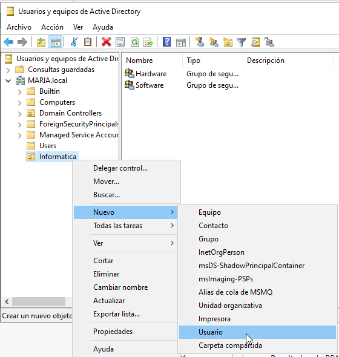

# Dominis 

Per a la documentació completa visita [mkdocs.org](https://www.mkdocs.org).

---
## Introducció

Aquest projecte mostra el procés que he seguit per configurar un domini en una xarxa Windows. L’objectiu principal ha estat aprendre a gestionar usuaris, grups i perfils mòbils per centralitzar la informació, així com aplicar polítiques de seguretat per controlar l’accés als recursos.

També he treballat amb la configuració de servidors de fitxers, d’impressió i d’aplicacions, tot fent proves en màquines virtuals. Durant el projecte, he anat resolent problemes reals que poden aparèixer en un entorn informàtic i he après a aplicar bones pràctiques de seguretat i gestió.

---

## Instal·lació Domini AD, Unir equips al domini i Gestió del Domini AD

Un domini és una xarxa controlada centralment on els usuaris i equips comparteixen recursos, com arxius i impressores. Un servidor de domini utilitza Active Directory (AD) per gestionar tots els comptes d’usuaris, equips i recursos. Així, els administradors poden controlar qui té accés a què i com es poden fer servir els recursos de la xarxa.

Per començar a usar un domini, primer hem d'instal·lar Active Directory Domain Services (AD DS) en un servidor. Aquest servidor es converteix en el controlador de domini, el cervell que controla qui pot entrar i què pot fer a la xarxa. Un cop tenim el domini creat, els equips poden unir-se al domini perquè els usuaris hi accedeixin fàcilment des de qualsevol dispositiu que estigui configurat per al domini.

### Creació del domini

1. El primer que haurem de fer és desactivar el Firewall de Windows, es necessari per que els clients i el servidor puguin estar comunicats.        
 
 
 

2. Seguidament, canviarem el nom de l'equip, així ens serà més fàcil gestionar l'Active Directory.      
 
 

3. A més revisarem la configuració de xarxa i comprovarem que tenim connexió a internet.        

4. A continuació, en el panel de control del Windows Server clicarem en "Administrar", "Agregar roles y caracteristicas" i anirem clicant següent.      
 
 
 

5. Aquí és important seleccionar l'opció "Servicios de dominio de Active Directory" i continuar amb el procés.      

6. Quan acabi, en les notificacions clicarem a "Promover este servidor a controlador de dominio".       

7. Aqui haurem d'afegir un nou bosc i crear un nom de domini, en aquest cas el meu és MARIA.local.      

8. Seguidament, li assignarem una contrasenya, aquest és important que sigui segura i evidenment recordar-la, ja que sinó hauríem de començar de nou.       

9. Continuarem clicant en següent fins que acabi la instal·lació i es reinicie automaticament.      

10. Un indicador de que el procés a sortit bé és que al inciar sessió com a adminitrador aparegui el nom del domini.        

---

### Usuaris, equips, grups i UOs

1. El primer que haurem de fer per crear usuaris, grups i UOs és clicar en "Herramientas" i després en "Usuarios y equipos de Active Directory".        

2. Per crear les Unitats Organitzatives haurem de clicar a sobre de MARIA.local (el domini), seleccionar "Nuevo" i clicar en "Unidad Organizativa".     

3. Seguidament li ficarem un nom, en aquest cas jo la he anomenat "Informatica".        

4. Ara crearem els grups, aquí haurem de clicar a sobre de la UO, "Nuevo" i "Grupo".        

5. A continuació li assignarem un nom, en aquest cas he creat el grup Hardware i Software.      

6. El següent pas serà crear els usuaris, aquí haurem de configurar tota una serie de dades, com el nom complet.        

7. Després li crearem una contrasenya, aquesta a de ser robusta a causa de les politiques de seguretat de Windows. A més podem escollir diferents opcions en respecte a la contrasenya, en aquest cas jo he escollit que no expiri mai.         

8. Ara farem el mateix per crear l'usuari Andrea.       

9. Tot seguit, clicarem en les propietats del grup Hardware i afegirem a Andrea.        

10. Per últim, farem el mateix amb l'usuari Maria en el grup Software.      

#### UNIR CLIENT A DOMINI

1. El primer que haurem de fer és desactivar el Firewall.       

2. Seguidament comprovarem que ens podem comunicar des de el servidor amb el client.        

3. És important que a la configuració de xarxa tinguem com a DNs la ip del server.      

3. Després, clicarem en "Propiedades" i "Cambiar configuración".        

4. A continuació clicarem en "Cambiar..." i habilitarem l'opció de dominio, en la que ficarem el nom del domini.        

5. Afegirem l'usuari administrador del domini i la contrasenya i quan acabi de sincronitzar reiniciem la vm.        

6. Per últim, iniciem sessió amb l'usuari Maria i comprovem que des de el client ja estem connectats al domini. Una altra forma de verificar és anant al servidor, "Computers" i ens apareixerà el hostname del client.     

---

### Perfils mòbils i carpetes personals

Els perfils mòbils permeten que un usuari pugui iniciar sessió en qualsevol ordinador del domini i veure els seus fitxers i configuracions personals. Les carpetes personals són espais d’emmagatzematge en xarxa on els usuaris poden guardar els seus arxius, assegurant que els tingui disponibles sempre que ho necessiti, independentment de l’equip des del qual es connecti.

1. El primer pas serà crear la carpeta Perfils i anar a Propietats.         
 
 

2. Seguidament li treurem els permisos heredats en "Opciones avanzadas".        
 
 
 

3. Després treurem tots els usuaris que hi han menys Administradores i seguidament afegirem els grups de la UO Informatica.     
 

4. Ara clicarem en "Compartir..." i quan sobri la finestra tornarem a clicar en "Compartir".        

5. Seguidament anirem a l'usuari Andrea i clicarem en "Propiedades", després en "Perfil" i afegirem la ruta de la carpeta "Perfils".        
 
 

6. A continuació des de l'ordinador client, inciarem sessió amb l'usuari.       

7. Una vegada fet el pas anterior, si tornem al server i revisem el contigut de la carpeta "Perfils" podrem observar que s'ha creat una carpeta amb el username de Andrea.      

8. Tornarem a la màquina client per crear una carpeta anomenada "prova". Ara tot el que creem amb l'usuari Andrea és guardar al server.     

9. Tanquem sessió al client i inciem sessió des de un altre client.     

10. Per últim podrem observar que la carpeta esta quan iniciem sessió encara que sigui una altra màquina virtual.       

---

### Recursos compartits

Els recursos compartits com impressores i carpetes permeten que diversos usuaris de la xarxa accedeixin a aquests elements. Això vol dir que si un ordinador té una carpeta compartida, altres usuaris del domini poden accedir-hi per veure o editar els fitxers que hi ha dins.

#### CARPETES I FITXERS

1. El primer que farem és crear la carpeta "Informes", després anirem a "Propiedades".      

2. Clicarem en "Compartir" i afegirem permisos de lectura només al grup Hardware.       

3. Quan inciem sessió desde el client amb l'usuari Andrea que forma part del grup Hardware, podrem entrar dins de la carpeta, però quan intentessim crear algun fitxer ens sortirà el següent error:       

4. Per últim, si inciem sessió amb l'usuari Maria com forma part només del grup Software quan intente entrar no podrà. Ens sortirà el següent avís:     

5. També podem fer la compartició de fitxers a partir d'un rol, per començar haurem de afegir un nou disc de 5 GB.      
 
 
 
 
 
 
 
 
 

6. Seguidament afegirem el rol de "Administración de recursos del servidor de archivos".        
 
 
 
 
 
 
 

7. A continuació, entrarem en l'apartat de "Recursos compartidos", clicarem en "TAREAS" i "Nuevo recurso compartido...".        
 

8. Aquí dins escollirem l'opció de "SMB - Avanzado".        
 

9. Seleccionarem el disc nou, li ficarem un nom al recurs compartit i activarem la primera opció de "Parametros de configuración de recurso compartido".        
 
 
 

10. Seguidament, deixarem els permissos predeterminats, en cas de que volguem aplicar permissos més especifics hauríem de fer el procés d'abans.        
 

11. Clicarem en l'opció "Archivos de usuario".      

12. També tenim l'opció d'aplicar quotes, en aquest cas ens ho saltem perquè aquest tema ja l'hem donat.        
 

13. Ara clicarem en "Crear" i quan acabi en "Cerrar".       
 
 

14. Des de el client anirem a Xarxa i afegirem la ruta.     
   

15. Després crearem una carpeta.        
 

16. En el servidor farem clic dret al recurs compartit i seleccionarem l'opció "Abrir recurso compartido".      
 

17. Al obrir-ho podrem veure que està la carpeta creada amb el client.      

#### IMPRESSORES

1. El primer que haurem de fer és afegir un rol nou, aquest s'anomena "Servicios de impresión y documentos".        
 
 
 
 
 
 
 
 
 
 
 

2. Seguidament, desplegarem "Herramientas" i clicarem en "Administración de impresión".     
 

3. Aquí dins farem clic dret a sobre del domini i seleccionarem l'opció "Agregar impresora...".     
 

4. Tot seguit, podrem buscar la impressora o afegir-la manualment.      
 

5. Si escollim l'opció d'afegir-la manualment només haurem de ficar la ip o el nom especific.       
 

6. En aquest cas jo no tinc cap impressora, per tant no puc continuar el procés.        
 

7. Una vegada la tinguessim afegida, hauriem d'anar a "Propiedades" i "Compartir", el procés és similar al de compartir una carpeta.        

---

## Polítiques de seguretat (GPOs)

Les Polítiques de Grup (GPOs) són un conjunt de regles que permeten als administradors controlar l’accés i la seguretat dins del domini. Per exemple, les GPOs poden configurar coses com les contrasenyes (quina complexitat han de tenir), els permisos d’accés a recursos, o les restriccions d'ús de programes. Això ajuda a garantir que els equips i usuaris de la xarxa segueixin unes normes de seguretat comunes.

1. El primer pas serà anar a "Herramientas" i "Administración de directivas de grupo".      
 

2. Després clicarem en editar la GPO predeterminada i entrarem dins de "Directiva de contraseña".       
 
 

3. Seguidament en les propietats de la segona i cinquena opció configurarem que la longitud mínima del les contrasenyes sigui de 12 caracters.      
 
 
 
 
 

4. Ara comprovarem que funcioni correctament, crearem un nou usuari i li ficarem una contrasenya de 4 carcters. Quan cliquem en "Finalizar" podrem observar que salta un error de contrasenya.      

5. Tot seguit, introduirem una contrasenya de 12 caracters i podrem observar que ja funciona.       

6. La segona GPO la crearem nosaltres, haurem de clicar en el nom del domini i clicar ne la primera opció.      

7. A continuació clicarem "Editar..." i entrarem en "Menu inicio y barra de tareas".        

8. Clicarem la quarta opció, aquesta serveix per no poder utilitzar les opcions d'apagar, reiniciar, suspendre o inverna el sistema.        

9. Seguidament clicarem en "Habilitada", quan anesim a apagar la màquina ja no podrem.      

10. Per fer la tercera GPO només la aplicarem en la UO Informatica.     

11. Haurem d'anar a "Active Desktop" i editar l'opció "Tapiz de escritorio".        

12. Seguidament anirem a C: i crearem la carpeta GPO. A més anirem a les propietats i compartirem la carpeta.       

13. Dins afegirem una foto per al fons de pantalla.     

14. Tornarem on ens habiem quedat abans amb la configuració de la GPO i clicarem en "Habilitada". A més a més, ficarem la ruta d'on està la foto per al fons de pantalla.       

15. Des de el terminal del Server actualitzarem les GPOs.       

16. Per últim iniciarem sessió amb un dels usuaris de la UO Informatica, com podem observar automaticament se li assigna el fons de pantalla.       

---

## Connexió remota

La connexió remota permet a un usuari o administrador connectar-se a un equip del domini des de qualsevol lloc a través d’Internet. Això és útil per resoldre problemes a distància, gestionar equips, o accedir a dades com si fossis davant de l’ordinador. La connexió remota es fa sovint mitjançant RDP (Remote Desktop Protocol), que permet controlar l'ordinador de forma visual i interactiva des d'un altre dispositiu.

1. El primer que haurem que fer és anar a Servidor local, "Escritorio remoto" i clicar en "Deshabilitado".      
 

2. Seguidament, clicarem en "permitir" i tancarem.      
 

3. Com podem observar al sortir, ara ja fica "Habilitado".      

4. En el client, obrirem la aplicació "Connexió a Escritorio Remoto".       
 
 

5. Introduirem la ip i l'usuari.        
 

6. Ficarem la contrasenya i començarà a connectar-se.       
 
 

7. Per últim ja estarem dins.       

---

## Webgrafia

Molta de la informació extreta està al Moodle de 0369 - Implantació de Sistemes Operatius. Seguidament, els següents links són d'internet:

- **YouTube**. Crear un domini amb Windows Server. Disponible a: <https://www.youtube.com/watch?v=ZhoIlrVxy_c>  
- **LabsMac**. Establir fons de pantalla a través d’una GPO. Disponible a: <https://www.labsmac.es/establecer-fondo-de-pantalla-a-traves-de-una-gpo/>  
- **YouTube**. Crear usuaris i unitats organitzatives a Windows Server. Disponible a: <https://www.youtube.com/watch?v=tmr6iMdR6rs>  
- **YouTube**. Configurar perfils mòbils. Disponible a: <https://www.youtube.com/watch?v=dhii6VVLGNU>  
- **YouTube**. Connectar equips al domini. Disponible a: <https://www.youtube.com/watch?v=NimRpg_X9I4>

---