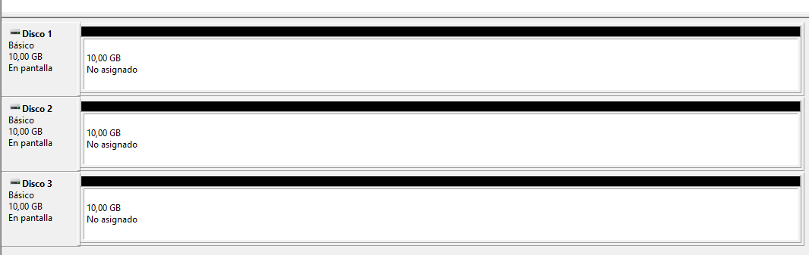

# Gestió de discs

Per a la documentació completa visita [mkdocs.org](https://www.mkdocs.org).

---

## Introducció

En entorns informàtics, protegir les dades i garantir el funcionament del sistema davant fallades de disc és essencial. Per això s’utilitza RAID, una tecnologia que combina diversos discos per millorar la seguretat i el rendiment.

Aquest projecte consisteix a configurar RAID en una màquina virtual amb Windows Server 2022, utilitzant eines com Disk Management o Storage Spaces. Es provara RAID 5, i es simularan fallades per comprovar el comportament i la recuperació del sistema.

L’objectiu és entendre el funcionament de RAID, com es configura, i com ajuda a evitar la pèrdua de dades. Tot el procés es documentarà amb captures i explicacions senzilles.      

---

## RAID - 5
Al següent apartat s'explicarà pas a pas com configurar RAID-5 en Windows Server 2022:

1. El primer que haurem de fer és afegir 3 discs nous a la màquina virtual.     
 

2. Seguidament anirem a "Administración de discos" i afegirem tots els discs en MBR.        
 
 

3. Després farem clic dret en un dels discs i clicarem en "Nuevo volumen RAID-5...".        
 
 

4. Tot seguit, aplicarem tots el disc nous, per fer el raid 5.      
 
 

5. A continuació escollirem la lletra de unitat.        
 

6. Seguidament, formatarem el volum amb NTFS i li assignarem un nom.        
 

7. Després clicarem en "Finalitzar" i en "Sí" a l'advertencia.          
 
 

8. El següent que farem és espera que s'acabi de formatar, aquest proces pot tirgar uns minuts.     
 

9. Una vegada ja ha acabat, en hauria de sortir com a "Correcto".       
 

10. Després entrarem dins del volum, crearem una carpeta i afegirem una serie d'imatges. Haurem de comprovar que podem obrir les imatges.       
 
 

11. Tot seguit tornarem a "Administración de discos" i desconectarem un dels discs.         
 
 

12. Per a comprovar que el RAID 5 encara funciona obrirem una de les imatges.       
 

13. Seguidament, tornarem a "Administración de discos" i desconectarem un segon disc. Com podem observar ara l'estat del volum és "Error".      
 
 

14. En fer la comprovació podem observar que ja no apareix el volum "R:".       
 

15. Per últim, activarem un dels disc per comprovar que torna a funcionar perfectament.     
 
 

16. En cas de voler, afegir un nou disc a Windows Server i afegir-lo al volum del RAID-5 serà impossible fer-ho sense eliminar el volum i tornar a crear RAID-5. Si no tenim cap altra solució, el que podem fer és una còpia de seguretat del contigut del volum, per no perdre les dades. En les següent captures he eliminat el volum i al intentar accedir als continguts dona el següent error:
 

---

## Webgrafia

Molta de la informació extreta està al Moodle de 0369 - Implantació de Sistemes Operatius.

* RAID. Disponible a: <https://moodle.iesebre.com/pluginfile.php/257917/mod_resource/content/6/RAIDS.pdf>

---
