# Autorització i auditories en Windows

Per a la documentació completa visita [mkdocs.org](https://www.mkdocs.org).

---

## Introducció

En aquesta part de la documentació, es treballa l’autorització i, sobretot, les auditories en Windows Server. S’explica com es configuren les auditories de seguretat, per a què serveixen i com ajuden a controlar l’accés als recursos i detectar activitats sospitoses.

També es fan proves pràctiques per veure com funcionen, generant esdeveniments tant correctes com erronis, i analitzant els resultats al visor d’esdeveniments del sistema.
    

---

## Autorització en Windows
L’autorització a Windows serveix per controlar qui pot fer què dins del sistema. És a dir, pots decidir quins usuaris poden veure, obrir, modificar o esborrar fitxers o carpetes. Això es fa posant permisos als usuaris o grups. Per exemple, pots fer que un usuari només pugui llegir una carpeta però no canviar res. També pots fer que un altre usuari pugui modificar-ho tot. Això es fa des de les propietats del fitxer o carpeta, a l'apartat de "seguretat".

També existeixen les "directives de seguretat", que són normes que es poden aplicar al sistema per controlar millor els permisos i les accions dels usuaris. Es poden aplicar a un sol ordinador o a molts si estàs en una xarxa amb un servidor.

---

## Auditories: què són i per a què serveixen
Les auditories són com un sistema de control que et permet saber què passa dins del teu Windows Server. Serveixen per registrar coses com qui ha intentat entrar al sistema, qui ha accedit a una carpeta, qui ha modificat un fitxer, etc. És molt útil si vols tenir un control de seguretat i saber si algú fa coses rares o no autoritzades.

Amb les auditories pots saber, per exemple, si algú ha intentat entrar amb un usuari que no li tocava, o si ha volgut esborrar un arxiu important. També t’ajuden a veure si tot funciona bé o si cal canviar alguna configuració.

Per activar les auditories a Windows, s’ha d’obrir secpol.msc i escollir què es vol controlar, com inici de sessió o accés a fitxers. Després, cal anar a les propietats del fitxer o carpeta, a “Seguretat” i afegir l’usuari que volem auditar i què volem registrar.

Els resultats es poden veure al visor d’esdeveniments (eventvwr.msc), on apareixen amb codis com el 4624 (entrada correcta) o 4625 (fallida). És important no activar massa auditories perquè poden fer el sistema més lent.

---

## Part pràctica

1. El primer que hem de fer és anar a "Directivas de seguridad local" > "Directivas locales" > "Directiva de auditoría". Allà activem dues opcions importants: "Auditar eventos de inicio de sesión" i "Auditar el acceso a objetos". Això farà que el sistema comenci a registrar qui inicia sessió i qui accedeix a fitxers o carpetes.       
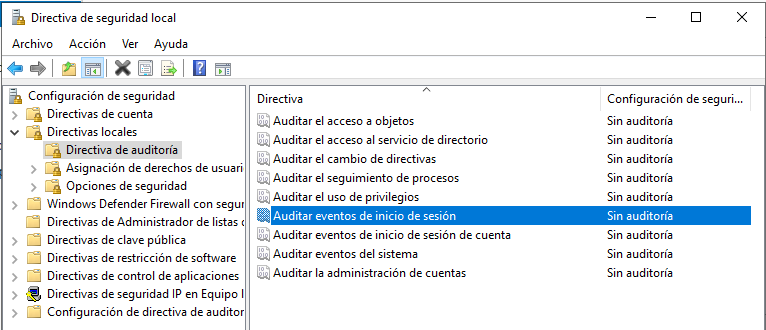 
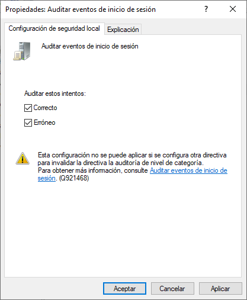 
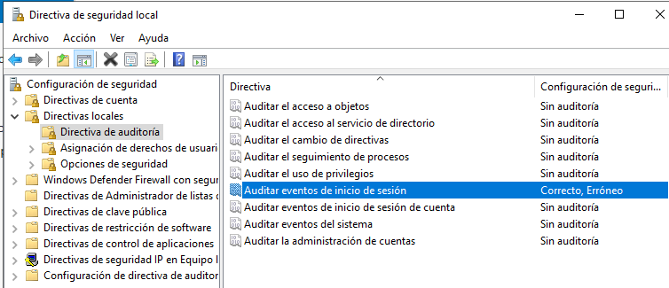 
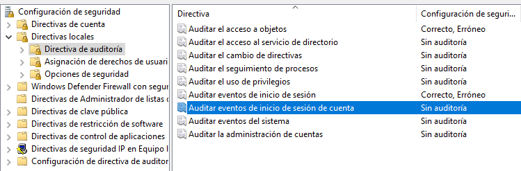 

2. Després, fem un inici de sessió amb qualsevol usuari. Si tot va bé, al Visor d’esdeveniments (eventvwr.msc) ens hauria d’aparèixer l’event ID 4624, que vol dir que l'inici de sessió ha estat correcte.     
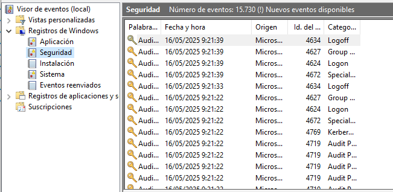 
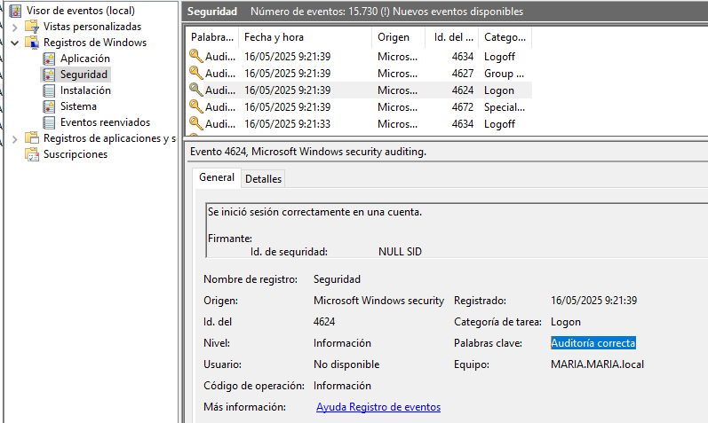 

3. A continuació, creem una carpeta nova i hi configurem l’auditoria. A les propietats de la carpeta, afegim a l’usuari Maria amb permisos de només lectura a l’apartat d’auditoria.        
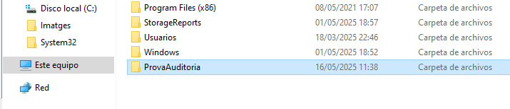 
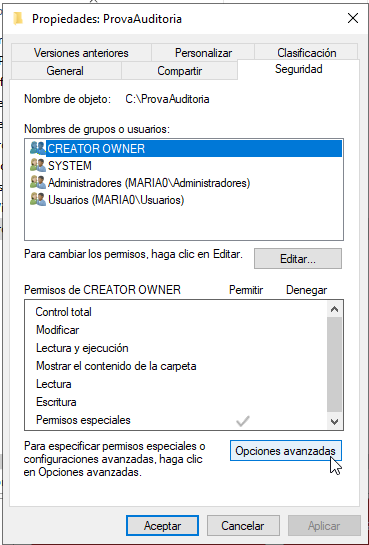 
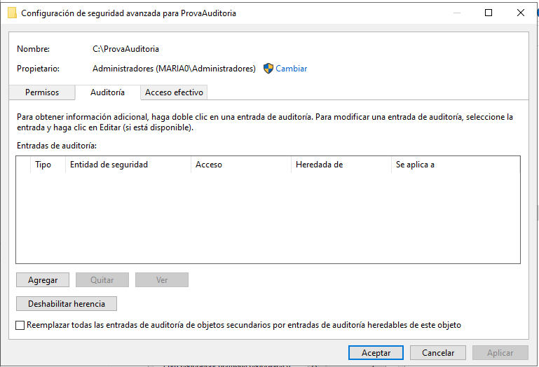 
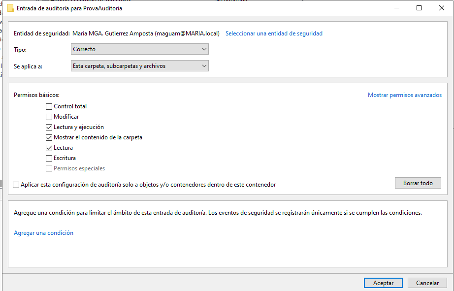 
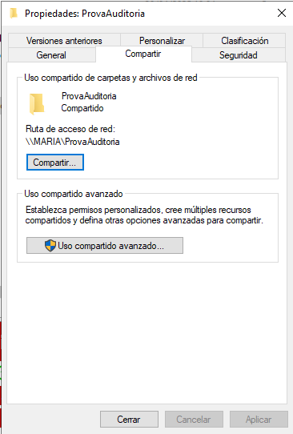 

4. També afegim l’usuari Administrador amb tots els permisos per a que puguem provar diferents accions.     
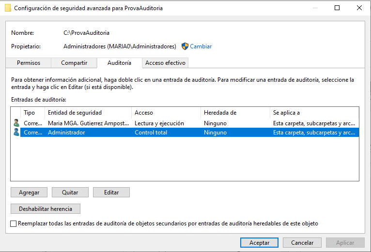 

5. Quan fem accions com crear, llegir o modificar arxius dins la carpeta, si anem al Visor d’esdeveniments veurem l’event ID 4663, que ens indica que s’ha accedit a un objecte (en aquest cas, la carpeta o els arxius).       
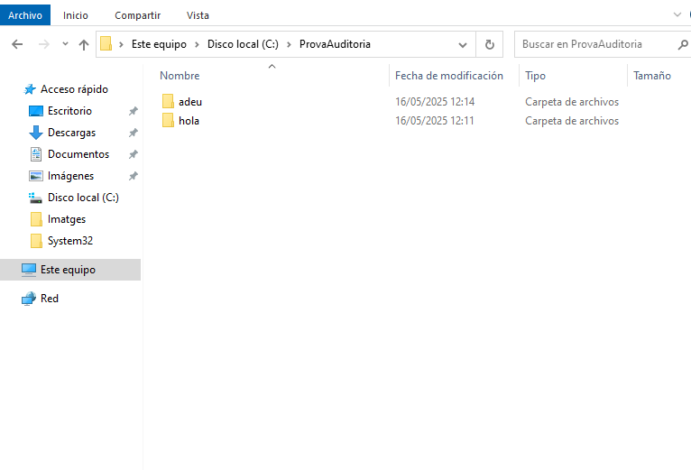 
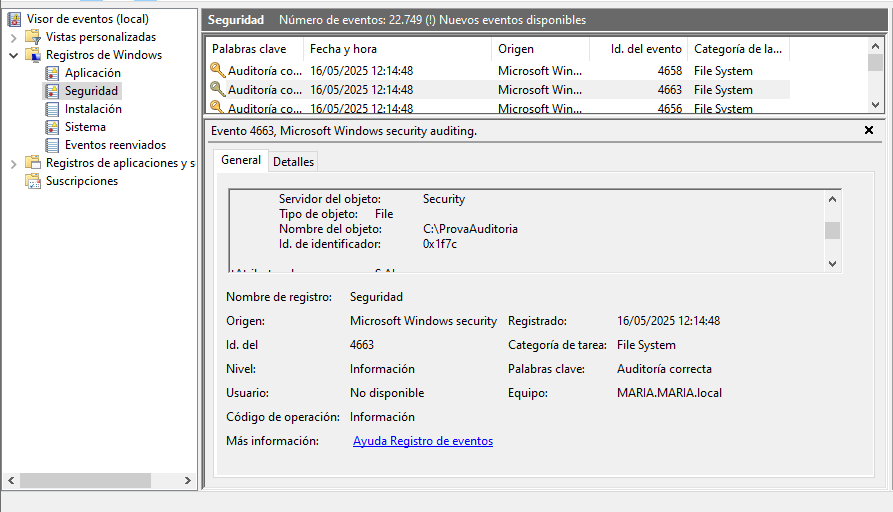 

6. Ara activem l’auditoria de "Auditar el seguimiento de procesos". Per provar-la, simplement obrim un programa, com per exemple Microsoft Edge. Això hauria de generar l’event ID 4688, que indica que s’ha iniciat un procés.     
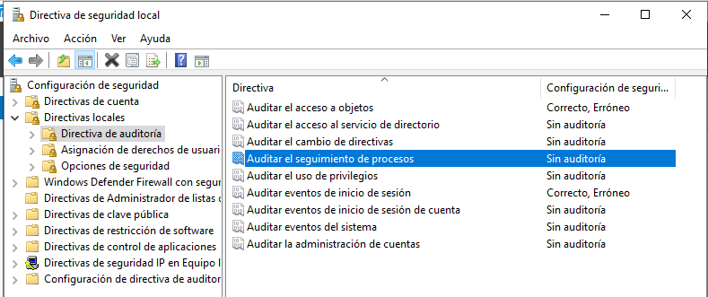 
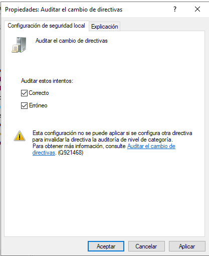 
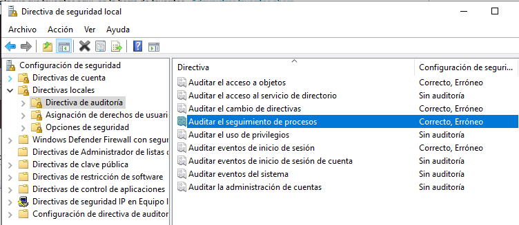 
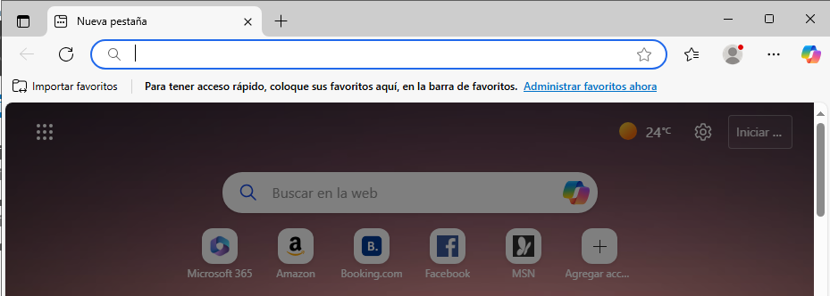 
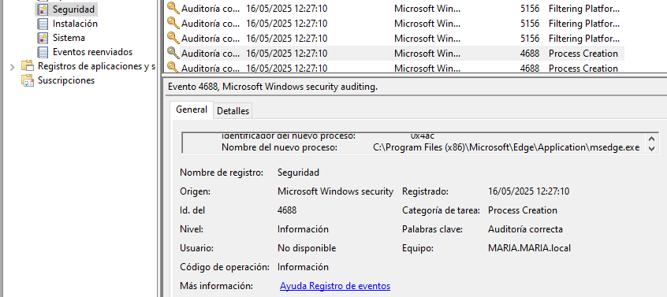 

7. Per veure l’event ID 4689, que mostra quan un procés acaba, tanquem Edge des del Administrador de tasques (taskmgr).     
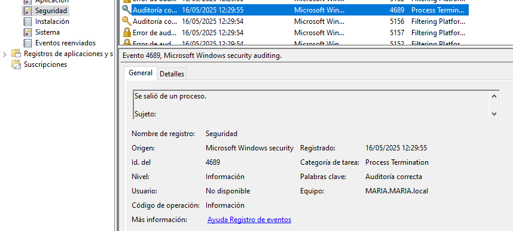 

8. Després activem "Auditar la administración de cuentas". Aquí farem algunes proves: primer, creem un usuari nou. Això generarà els codis 4720 (usuari creat) i 4722 (usuari activat).     
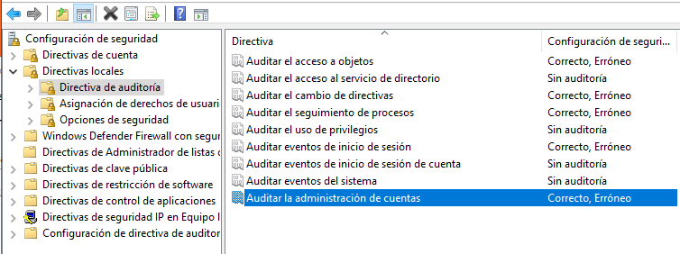 
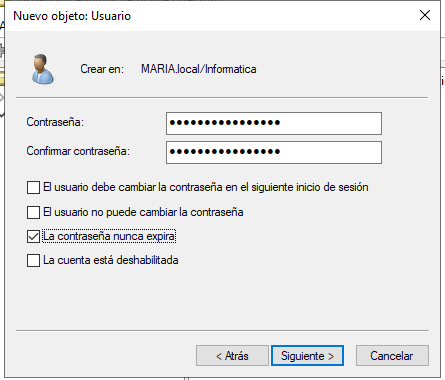 
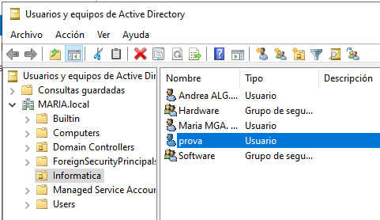 
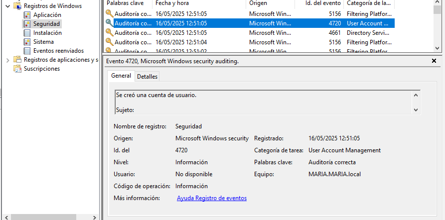 
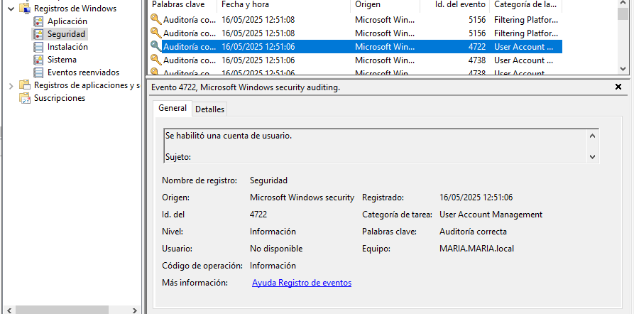 

9. Si després desactivem aquest usuari, veurem el codi 4725 al visor.       
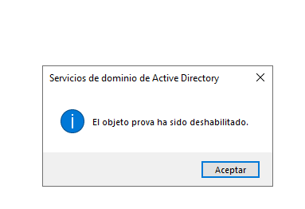 
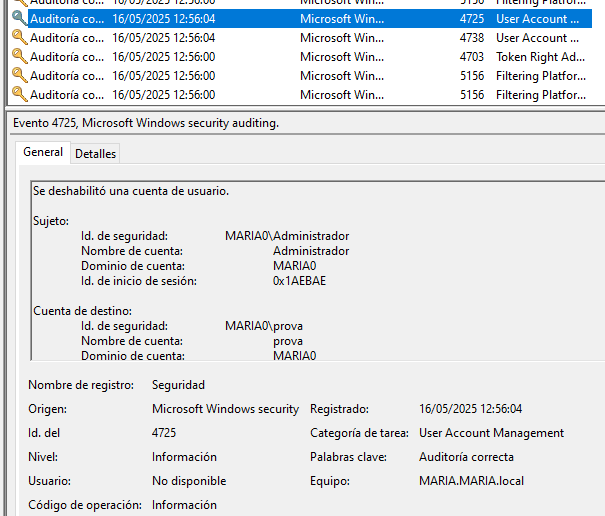 

10. I finalment, si eliminem l’usuari, apareixerà el codi 4726.     
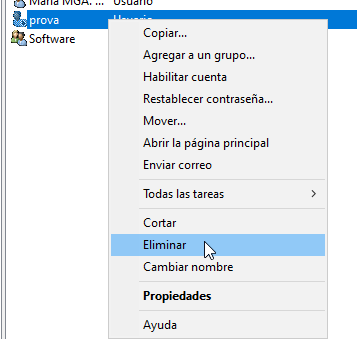 
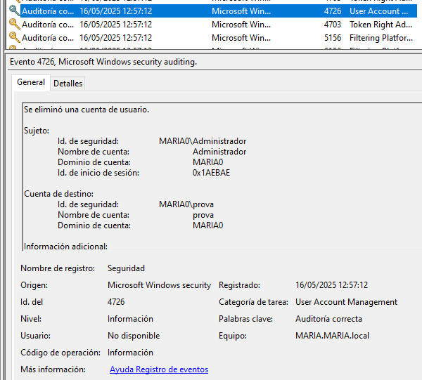

---

## Webgrafia

Molta de la informació extreta està al Moodle de 0369 - Implantació de Sistemes Operatius. Seguidament, els següents links són d'internet:

* Vídeo YouTube: Cómo configurar auditorías en Windows Server. Disponible a: <https://www.youtube.com/watch?app=desktop&v=4UgQnVhA9sU>
* Vídeo YouTube: Auditorías en Windows Server 2019. Disponible a: <https://www.youtube.com/watch?v=FqOYtkzNs8U>
* Documentació oficial de Microsoft sobre polítiques d’auditoria centralitzades. Disponible a: <https://learn.microsoft.com/es-es/windows-server/identity/solution-guides/deploy-security-auditing-with-central-audit-policies--demonstration-steps->
* Micromouse: Política de auditoría en Windows. Disponible a: <https://www.micromouse.com/2023/07/21/politica-auditoria-windows/>
* Blog UGR: Activar la auditoría de inicio de sesión en Windows. Disponible a: <https://blogs.ugr.es/seguridadinformatica/activar-la-auditoria-de-inicio-de-sesion-en-windows/>

---